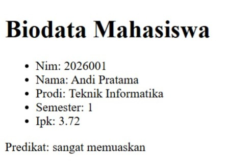
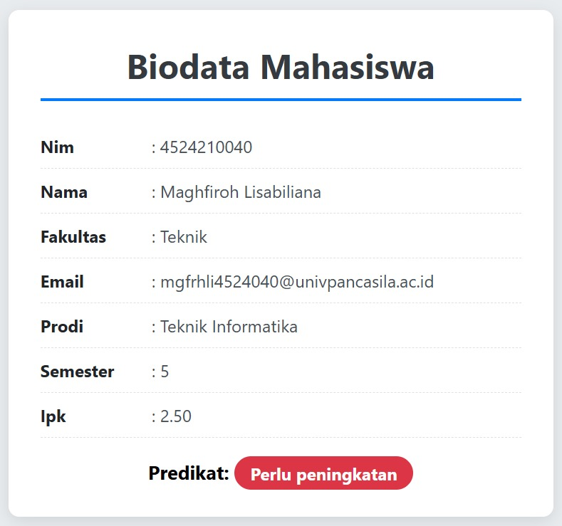
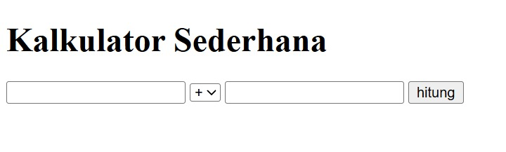
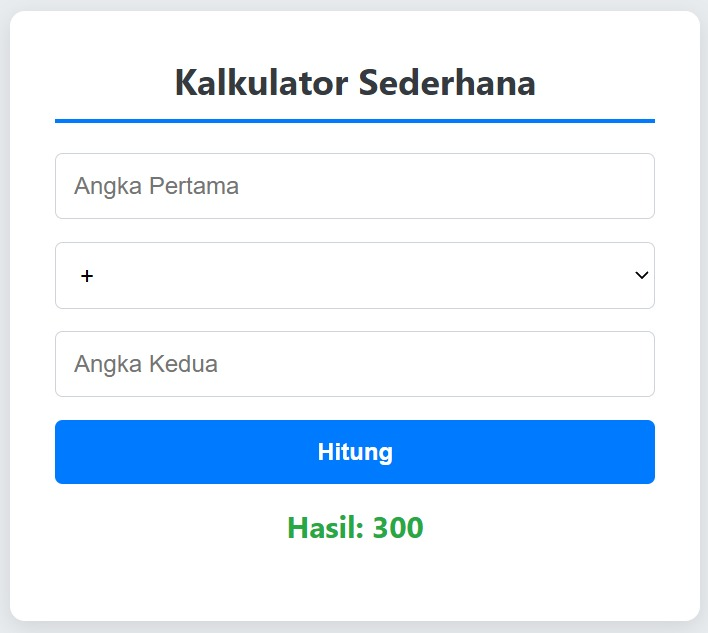

# Laporan Tugas 1 - Praktikum Pemrograman Web 

**Nama:** Maghfiroh Lisabiliana  
**NIM:** 4524210040   
**Kelas:** A 

---

## 1. Eksekusi Program Dasar
Seluruh contoh kode dasar dari modul Pertemuan 1 Program Biodata Array Asosiatif dan Kalkulator Sederhana telah digabungkan ke dalam file PHP dan berhasil dijalankan melalui *local server* (Laragon). Program berjalan dengan baik dan menampilkan output tanpa adanya error kritis.

## 2. Modifikasi pada Program
Telah dilakukan beberapa modifikasi bermakna pada program dasar untuk meningkatkan fungsionalitas dan antarmuka:
* **Penambahan Field Array (Biodata):** Menambahkan data `fakultas` dan `email` ke dalam array asosiatif `$mahasiswa`.
* **Fungsi Dinamis UI (Biodata):** Membuat fungsi baru `warnabadge()` agar warna latar predikat kelulusan berubah secara otomatis (Hijau untuk Sangat Memuaskan, Kuning untuk Memuaskan, Merah untuk Perlu Peningkatan) berdasarkan nilai IPK.
* **Penambahan Operator (Kalkulator):** Menambahkan operasi matematika Modulus (`%`) lengkap dengan validasi untuk mencegah error pembagian/modulus dengan angka nol.
* **Styling CSS Berbasis Card:** Merombak tampilan standar menjadi antarmuka modern berbentuk *Card* dengan *box-shadow*, merapikan susunan *form* menggunakan *Flexbox*, dan merapikan teks label.

## 3. Penjelasan 5 Bagian Kode Penting

* ### Penerapan *Type Hinting* pada Fungsi
    ```php
    function statuskelulusan(float $ipk): string
    ```
    *Penjelasan:* Memastikan bahwa parameter `$ipk` yang diproses secara ketat harus berupa angka desimal (`float`), dan data yang dikembalikan (return) harus berupa teks (`string`). Ini mencegah error manipulasi tipe data.

* ### Perulangan Array Asosiatif Dinamis
    ```php
    foreach ($mahasiswa as $kunci => $nilai):
    ```
    *Penjelasan:* Struktur perulangan yang efisien untuk mengekstrak kunci (*key*) dan nilai (*value*) dari array `$mahasiswa` sekaligus, sehingga kita tidak perlu memanggil isi data secara manual satu per satu ke dalam HTML.

* ### Keamanan *Cross-Site Scripting* (XSS)
    ```php
    htmlspecialchars((string)$nilai)
    ```
    *Penjelasan:* Fungsi ini sangat penting untuk mencegah kerentanan keamanan. Fungsi ini mengubah karakter khusus HTML (seperti `<` dan `>`) menjadi teks biasa sebelum dirender, mencegah eksekusi skrip berbahaya dari input pengguna.

* ### Validasi Operator Modulus dan Pembagian Nol
    ```php
    case '%':
        if ($b == 0) {
            $pesan = 'Modulus dengan nol tidak diperbolehkan.';
        } else {
            $hasil = $a % $b;
        }
    ```
    *Penjelasan:* Logika validasi krusial pada kalkulator. Dalam matematika dan pemrograman, angka tidak dapat dibagi atau dimodulus dengan nol karena akan menghasilkan error *Division by Zero*. Blok kondisi ini menanganinya dengan memberikan pesan peringatan.

* ### Penggabungan Logika PHP ke Atribut Class CSS
    ```html
    <span class="badge <?= warnabadge((float)$mahasiswa['ipk']) ?>">
    ```
    *Penjelasan:* Contoh implementasi UI dinamis. Atribut `class` pada HTML disisipi tag cetak PHP yang akan mengeksekusi fungsi `warnabadge()`, sehingga nama *class* dan warna elemen berubah otomatis sesuai hasil evaluasi IPK.

## 4. Screenshot Modifikasi

### 1. Biodata (Sebelum Modifikasi)



<br>

---

### 2. Biodata (Sesudah Modifikasi)



<br>

---

### 3. Kalkulator (Sebelum Modifikasi)



<br>

---

### 4. Kalkulator (Sesudah Modifikasi)



## 5. Analisis Error & Troubleshooting

* **Pesan Error:** `Warning: Undefined array key "IPK" in index.php on line ...`
* **Penyebab:** Terjadi kesalahan pembacaan kunci array akibat penulisan yang *case-sensitive*. Saat mencoba mencetak data IPK ke dalam fungsi kelulusan, variabel dipanggil dengan huruf kapital (`$mahasiswa['IPK']`), sedangkan deklarasi aslinya di dalam array menggunakan huruf kecil (`'ipk'`).
* **Langkah Perbaikan:** Menyesuaikan panggilan kunci (key) array agar persis sama dengan cara pendeklarasian aslinya, yaitu dengan mengubah kuncinya menjadi huruf kecil sepenuhnya (`$mahasiswa['ipk']`).